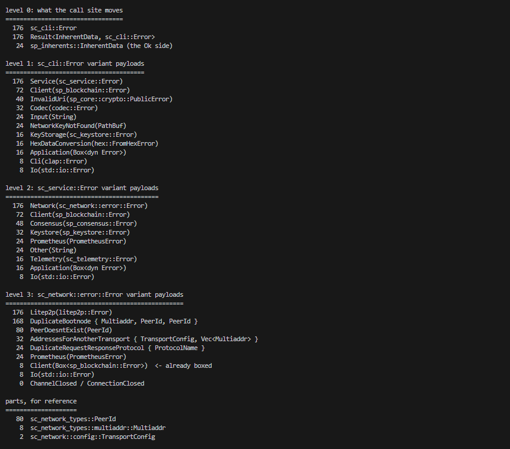

# sc-cli-error-size

Clippy's `result_large_err` fired on integritee-node 1.18.8:

```
the `Err`-variant is at least 176 bytes
try reducing the size of `sc_cli::Error`
```

Rather than suppress it blind, I measured where the bytes are.

`cargo test -- --nocapture`. Pinned to polkadot-stable2503-6.

## Result

```
sc_cli::Error                          176
  Service(sc_service::Error)           176
    Network(sc_network::error::Error)  176
      Litep2p(litep2p::Error)          176
      DuplicateBootnode                168   Multiaddr 8 + PeerId 80 + PeerId 80
```

`sp_inherents::InherentData`, the success value at the call site, is 24 bytes.

## What it shows

An enum is as large as its largest variant. So one fat variant sets the cost of
every value of that type, including the common ones.

Wrapping an error does not have to carry that cost forward. Each layer here
stored the inner error by value, which copies the layout and not only the
meaning. `Client(Box<sp_blockchain::Error>)` in the same network enum keeps
every detail at 8 bytes instead of 72, so the choice was available at each
level.

Because the size is set by the *largest* variant, boxing one fat variant buys
nothing when a second is nearly as fat. Here `Litep2p` at 176 and
`DuplicateBootnode` at 168 both hold the enum at 176.

## Reading

- https://rust-lang.github.io/rust-clippy/master/index.html#result_large_err
- https://docs.rs/sc-cli/0.52.0/sc_cli/enum.Error.html
- https://docs.rs/sc-network/0.50.1/src/sc_network/error.rs.html

## Capture

